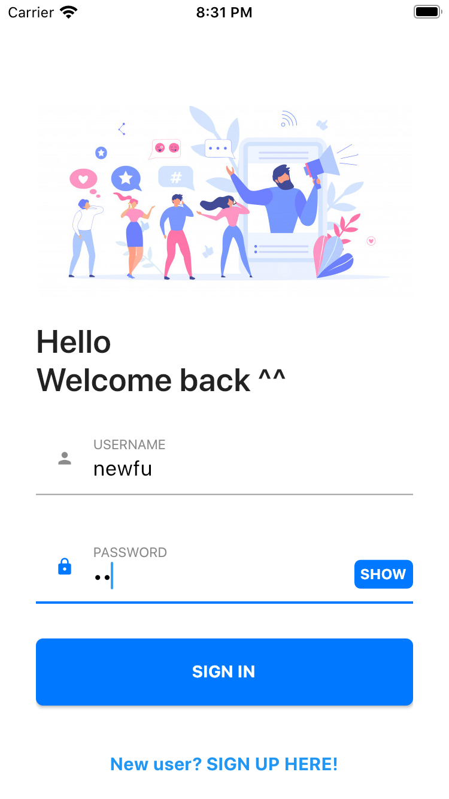
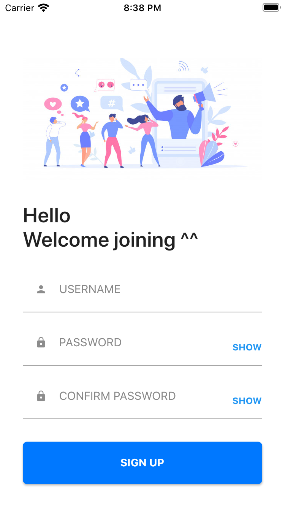
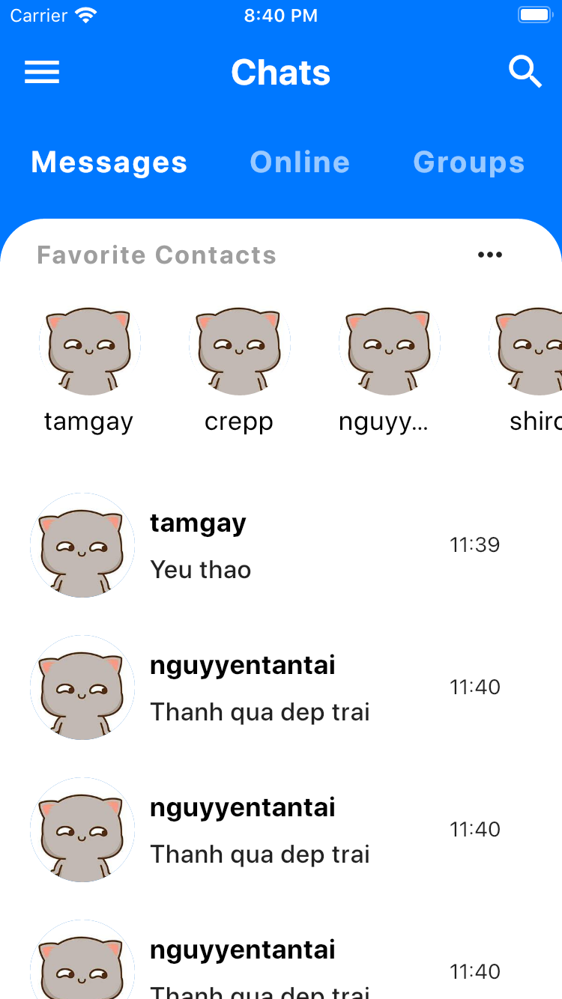
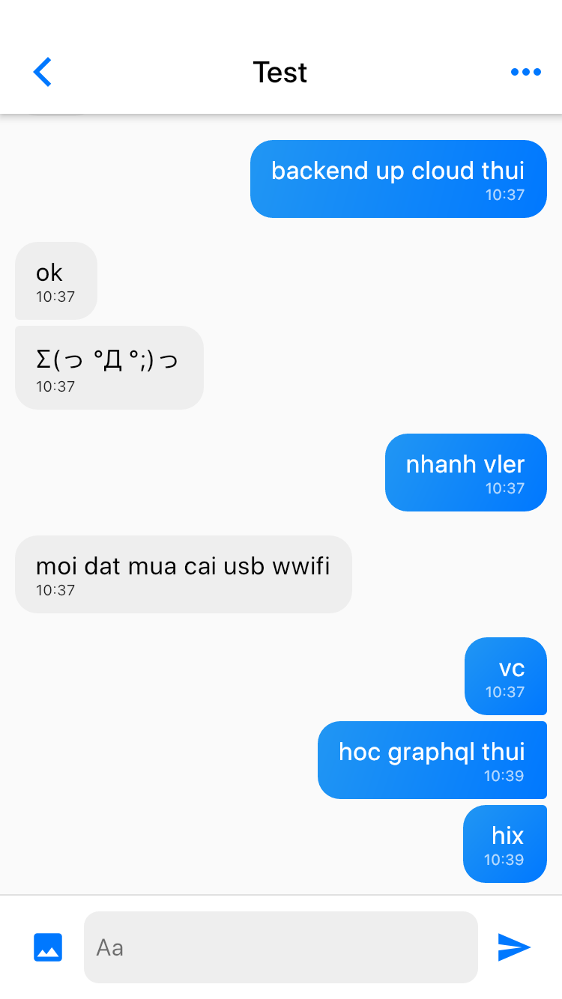

# Chat App Flutter (WIP)
Implement a mobile version for my MERN Stack Chat App.
You can get it from here ^^.
https://github.com/shivaluma/Chat-App

## Stack
* Using Flutter for crossplatform application
* BLoC Pattern

## Screenshot

___
Copyright by Nguyen Viet Thanh (Shivaluma)
